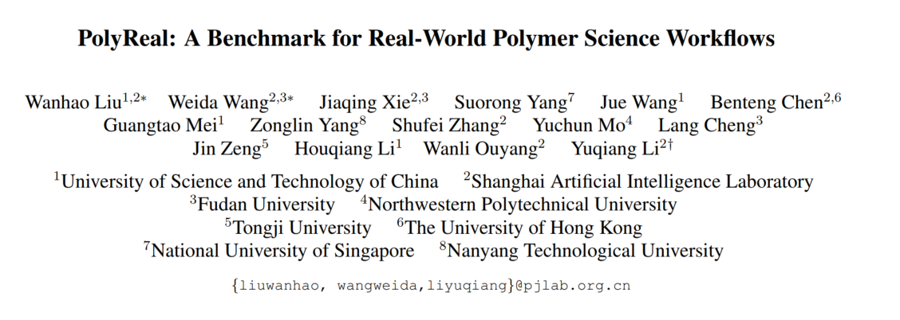
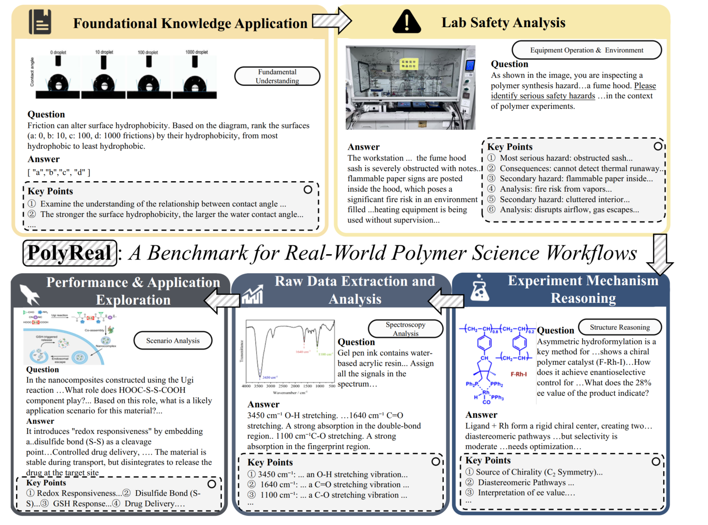
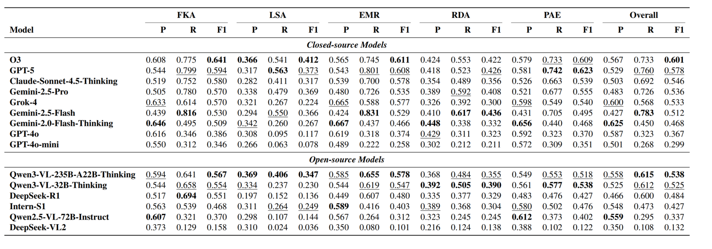

# PolyReal: A Benchmark for Real-World Polymer Science Workflows

<p align="center">
  <strong>Evaluating Multimodal Large Language Models Across the Full Lifecycle of Polymer Science</strong>
</p>

<p align="center">
  <a href="https://arxiv.org/pdf/2604.02934">
    
  </a>
  <a href="https://github.com/wanhaoliu/PolyReal">
    
  </a>
  <a href="https://huggingface.co/datasets/weidawang/PolyReal">
    
  </a>
  
  
  
</p>

<p align="center">
  <a href="#-overview">Overview</a> •
  <a href="#-benchmark-highlights">Highlights</a> •
  <a href="#-task-design">Task Design</a> •
  <a href="#-getting-started">Getting Started</a> •
  <a href="#-evaluation-pipeline">Evaluation Pipeline</a> •
  <a href="#-citation">Citation</a>
</p>

---
<p align="center">
  
</p>

<p align="center">
  <strong>Website:</strong> <a href="https://polyreal-benchmark.github.io/">https://polyreal-benchmark.github.io/</a>
</p>

## 🔥 Overview

**PolyReal** is a **multimodal benchmark for real-world polymer science workflows**.  
It is designed to evaluate Multimodal Large Language Models (MLLMs) on the **full lifecycle of polymer experimentation**, rather than only isolated, simplified tasks.

Unlike prior chemistry or materials benchmarks that mostly focus on single-step problems, PolyReal emphasizes **workflow-oriented evaluation** grounded in authentic scientific practice, covering:

- **Foundational knowledge application**
- **Lab safety analysis**
- **Experiment mechanism reasoning**
- **Raw data extraction and analysis**
- **Performance and application exploration**

The benchmark contains **545 high-quality question-answer pairs** built from **real experimental scenarios**, including **lab images, spectra, mechanism diagrams, and raw CSV data**.

---

## 🖼️ Teaser


<p align="center">
  
</p>

<p align="center">
  <em>PolyReal evaluates MLLMs across five key stages of real-world polymer science workflows.</em>
</p>

---

## ✨ Benchmark Highlights

- **Real-world workflow coverage**  
  PolyReal is built around the actual lifecycle of polymer science research, rather than disconnected toy tasks.

- **Multimodal and practice-grounded**  
  The benchmark includes diverse inputs such as **spectra, charts, mechanism diagrams, lab scenes, and structured/unstructured raw data**.

- **High-value scientific evaluation**  
  It targets challenging capabilities that matter in real research environments, including **safety understanding, data interpretation, and application reasoning**.

- **Beyond multiple-choice**  
  PolyReal includes **open-ended questions** and **ranking tasks**, enabling finer-grained assessment of scientific reasoning quality.

- **Strong diagnostic value**  
  The benchmark exposes a key weakness of current MLLMs: they often perform better on knowledge-heavy reasoning than on **practice-oriented, context-dependent scientific tasks**.

---

## 📊 Benchmark at a Glance

- **Domain**: Polymer Science
- **Benchmark Type**: Multimodal scientific evaluation
- **Total Samples**: **545**
- **Question Formats**:
  - Open-ended question answering
  - Numerical extraction
  - Ranking tasks
- **Data Sources**:
  - Real experimental scenarios
  - Scientific figures and mechanism diagrams
  - Lab photos
  - Spectra and raw CSV files

---

## 🧪 Task Design

PolyReal is organized into **five independent yet workflow-aligned modules**:

### 1. Foundational Knowledge Application
Evaluates whether models can apply core scientific principles to realistic polymer science scenarios.

### 2. Lab Safety Analysis
Tests visual scene understanding and hazard identification in cluttered, real-world laboratory environments.

### 3. Experiment Mechanism Reasoning
Assesses causal and procedural reasoning over reaction diagrams, structures, and scientific processes.

### 4. Raw Data Extraction and Analysis
Measures a model’s ability to parse and interpret raw scientific data, including **NMR**, **IR**, plots, and **CSV-based data**.

### 5. Performance & Application Exploration
Evaluates high-level reasoning on **structure–property relationships** and suitability for downstream applications.

---

## 🎯 Why PolyReal Matters

Modern MLLMs are increasingly strong in general multimodal reasoning, yet scientific practice requires more than broad knowledge.

PolyReal is designed to answer a more demanding question:

> **Can multimodal models operate reliably in authentic scientific workflows, where safety, mechanism understanding, raw data interpretation, and application reasoning are tightly connected?**

Our benchmark shows that even strong models still face substantial challenges when moving from **abstract scientific knowledge** to **practical, real-world scientific decision-making**.

---

## 🏆 Main Findings

<p align="center">
  
</p>

- Leading closed-source models achieve the strongest overall performance.
- Models tend to perform better on **knowledge-intensive reasoning** tasks.
- Performance drops substantially on **practice-based tasks**, especially:
  - **Lab Safety Analysis**
  - **Raw Data Extraction and Analysis**
- Many strong models show **high recall but relatively low precision**, suggesting a tendency toward verbose yet noisy scientific answers.
- Performance also varies notably across **different polymer sub-fields**.


---

## 📦 Dataset

**Hugging Face Dataset**:  

After downloading, the project root should contain:

```text
PolyReal.json      # Main dataset
ref/               # Reference images, spectra, CSVs, and other auxiliary files
```
## 🛠️ Getting Started

### 1. Clone the repository

```bash
git clone git@github.com:wanhaoliu/PolyReal.git
cd PolyReal
```

### 2. Install dependencies

```bash
pip install -r requirements.txt
```

### 3. Download the dataset from Hugging Face

```bash
pip install huggingface_hub

python - <<'EOF'
from huggingface_hub import snapshot_download

snapshot_download(
    repo_id="weidawang/PolyReal",
    repo_type="dataset",
    local_dir=".",
)
EOF
```

---

## 🔑 Environment Setup

Set your API endpoint and key before running inference:

```bash
export POLYREAL_API_BASE_URL="https://your-api-host.example.com"
export POLYREAL_API_KEY="your-api-key"
```

If you use `--model intern-s1`, also set:

```bash
export INTERN_S1_API_BASE_URL="https://your-intern-s1-host.example.com/api"
export INTERN_S1_API_KEY="your-intern-s1-api-key"
```

`POLYREAL_API_BASE_URL` should point to an **OpenAI-compatible** `/v1/chat/completions` endpoint, such as OpenAI, Together, OpenRouter, or a local vLLM deployment.

---

## 🚀 Evaluation Pipeline

### Step 1 — Inference

```bash
python test.py --model gpt-4o
```

Results will be saved to:

```text
result/gpt-4o/results_gpt-4o.jsonl
```

Already-processed items are automatically skipped, so the script supports resume.

### Arguments

| Argument | Default | Description |
|----------|---------|-------------|
| `--model` | `gpt-4o` | Model name sent to the API |
| `--workers` | `10` | Number of concurrent threads |
| `--input_file` | `PolyReal.json` | Dataset path |
| `--image_dir` | `ref/` | Directory containing reference images and CSVs |
| `--output_dir` | `result/` | Root output directory |

### Step 2 — Precision Evaluation

```bash
python eval_precision.py --model gpt-4o --eval_model gemini-2.5-flash
```

This stage uses a second LLM evaluator to compute:

```text
Precision = TP / (TP + FP)
```

Output:

```text
result/gpt-4o/precision_gpt-4o.jsonl
```

### Step 3 — Recall Evaluation

```bash
python eval_recall.py --model gpt-4o --eval_model gemini-2.5-flash
```

This stage measures answer completeness and coverage of key scoring points.

Output:

```text
result/gpt-4o/recall_gpt-4o.jsonl
```

### Step 4 — Ranking Evaluation

```bash
python eval_ranking.py
```

This script computes ranking-task metrics across all model folders under `result/`.

Output:

```text
result/{model}/ranking_{model}.jsonl
```

---

## 📏 Evaluation Metrics

PolyReal uses a more rigorous evaluation protocol than simple exact-match accuracy.

We report:

- **Precision (P)** — correctness of the answer
- **Recall (R)** — completeness of the answer
- **F1 Score (F1)** — harmonic mean of precision and recall

For each question, domain experts define **Key Points** that capture the essential scientific content expected in a correct answer.  
This allows PolyReal to evaluate not only whether a model answers, but also how well it answers in a scientifically meaningful way.

---

## 🧬 Repository Structure

```text
PolyReal.json          # Main dataset
ref/                   # Images, spectra, CSVs, and other reference files
test.py                # Inference script
eval_precision.py      # Precision evaluation
eval_recall.py         # Recall evaluation
eval_ranking.py        # Ranking evaluation
open_source_config.py  # API and path configuration helpers
requirements.txt       # Python dependencies
result/                # Output directory for inference and evaluation
logs/                  # Log files
```


---

## 📌 Notes

- API keys are loaded from environment variables only.
- `eval_precision.py` and `eval_recall.py` automatically skip ranking questions.
- Use `eval_ranking.py` for ranking-task evaluation.
- Please make sure to add your final open-source license file before public release.

---

## 📚 Citation

If you find PolyReal useful in your research, please cite:

```bibtex
@article{liu2026polyreal,
  title={PolyReal: A Benchmark for Real-World Polymer Science Workflows},
  author={Liu, Wanhao and Wang, Weida and Xie, Jiaqing and Yang, Suorong and Wang, Jue and Chen, Benteng and Mei, Guangtao and Yang, Zonglin and Zhang, Shufei and Mo, Yuchun and Cheng, Lang and Zeng, Jin and Li, Houqiang and Ouyang, Wanli and Li, Yuqiang},
  journal={arXiv preprint arXiv:2604.02934},
  year={2026}
}
```

---

## 🙏 Acknowledgements

We thank all contributors and domain experts involved in the construction and validation of PolyReal.

---

## ⭐ Star History

If PolyReal is helpful to your work, please consider giving this repository a star.

<p align="center">
  <a href="https://github.com/wanhaoliu/PolyReal">
    
  </a>
</p>
